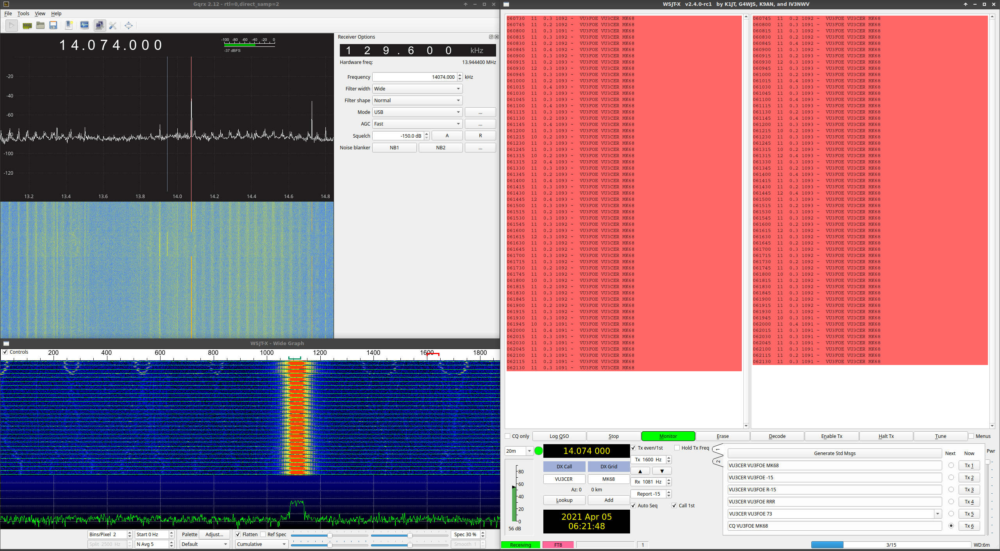
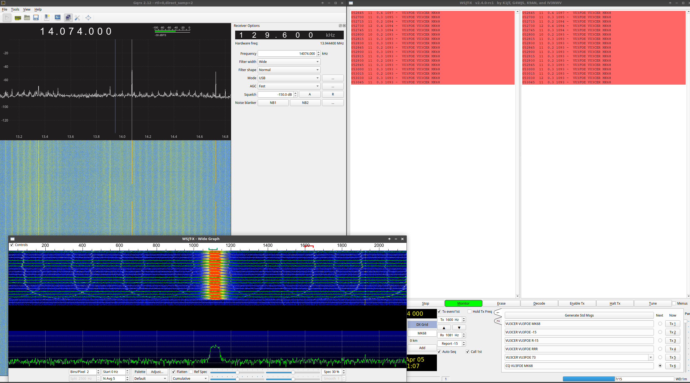
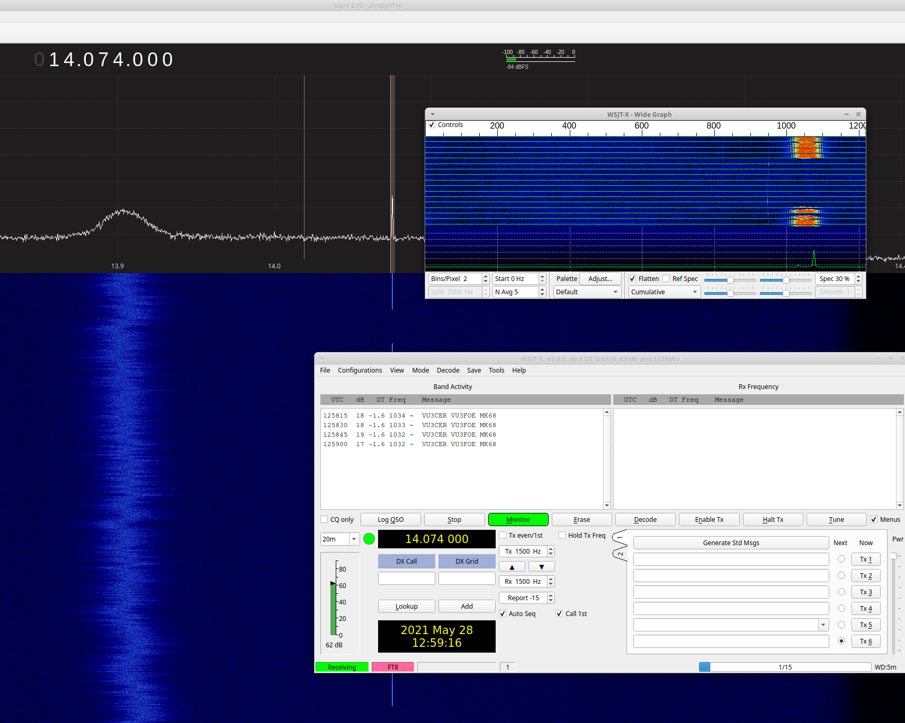

### Easy-FT8-Beacon-v3

UPDATE: See https://github.com/kholia/Easy-Digital-Beacons-v1 for more fun!

A simple Arduino Nano powered FT8 beacon which uses DS3231 RTC for timing.

The `DT` timings can be better than a PC / RPi!

The cold start frequency drift is minimal, and a non-issue.

DS3231 is quite reliable - here at the `DT` figures after ~2 months of offline storage.

#### Tips

- Use `sync.py` or https://github.com/kholia/SyncArduinoRTC for synchronizing the RTC.

  Note: Trigger `Sync` by pressing the push button connected to D7 at bootup!

- There is only one way to connect the RTC + Si5351 Module to the Arduino Nano - `Google Search` is your friend.

#### Notes

This will need a [HF PA](https://github.com/kholia/HF-PA-v2) in most cases to be usable on the air.

No end-user support is provided.

#### BOM

#### References

- https://lastminuteengineers.com/ds3231-rtc-arduino-tutorial/

- https://learn.adafruit.com/adafruit-si5351-clock-generator-breakout/wiring-and-test
